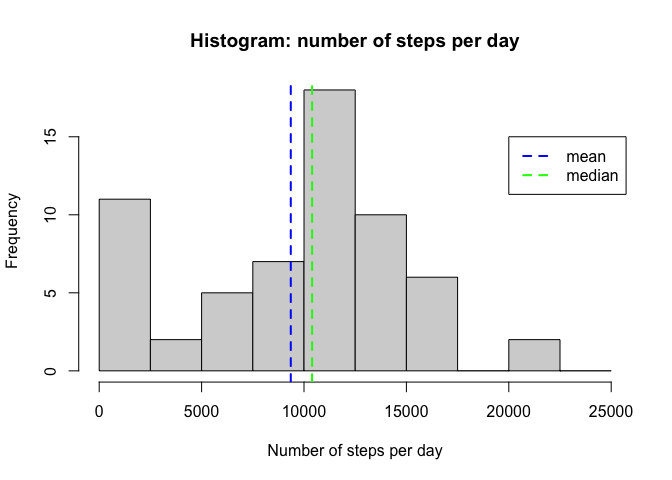
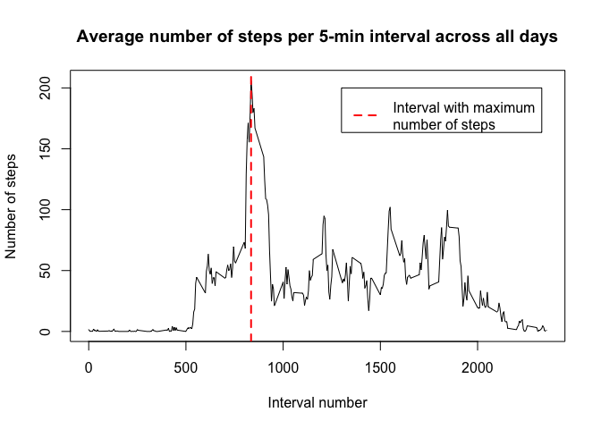
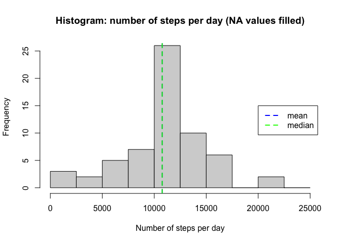
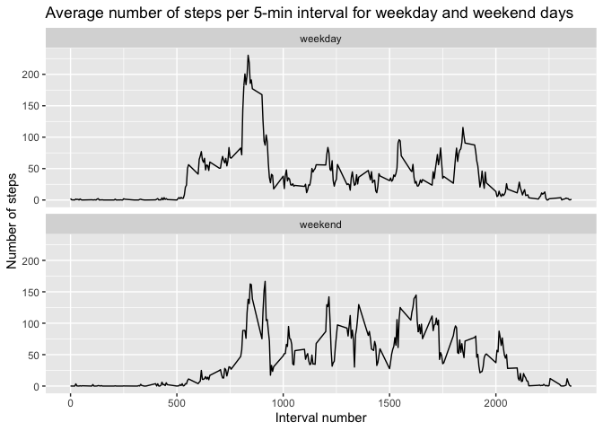

## Loading and preprocessing the data

1. Load the data:

    
    ```r
       steps_file <- "./activity.zip"
       if (!file.exists(steps_file)) {
           url <- "https://d396qusza40orc.cloudfront.net/repdata%2Fdata%2Factivity.zip"
           download.file(url, steps_file)
       }
       steps_data <- read.csv(unz(steps_file, "activity.csv"))
       str(steps_data)
    ```
    
    ```
    ## 'data.frame':	17568 obs. of  3 variables:
    ##  $ steps   : int  NA NA NA NA NA NA NA NA NA NA ...
    ##  $ date    : chr  "2012-10-01" "2012-10-01" "2012-10-01" "2012-10-01" ...
    ##  $ interval: int  0 5 10 15 20 25 30 35 40 45 ...
    ```

2. Process/transform the data (if necessary) into a format suitable for your analysis.

   Converting **date** column from character to date format:

    
    ```r
       steps_data$date <- as.Date(steps_data$date, "%Y-%m-%d")
       str(steps_data)
    ```
    
    ```
    ## 'data.frame':	17568 obs. of  3 variables:
    ##  $ steps   : int  NA NA NA NA NA NA NA NA NA NA ...
    ##  $ date    : Date, format: "2012-10-01" "2012-10-01" "2012-10-01" ...
    ##  $ interval: int  0 5 10 15 20 25 30 35 40 45 ...
    ```

## What is mean total number of steps taken per day?

1. Calculate the total number of steps taken per day.

    
    ```r
       library(dplyr)
       steps_per_day <- steps_data %>% group_by(date) %>%
                        summarize(steps = sum(steps, na.rm = TRUE))
    ```
    
    ```
    ## `summarise()` ungrouping output (override with `.groups` argument)
    ```

2. Make a histogram of the total number of steps taken each day.
3. Calculate and report the mean and median of the total number of steps taken per day.

    
    ```r
       hist(steps_per_day$steps, breaks = seq(0, 25000, 2500),
            main = "Histogram: number of steps per day",
            xlab = "Number of steps per day")
       mean_steps <- mean(steps_per_day$steps, na.rm = TRUE)
       median_steps <- median(steps_per_day$steps, na.rm = TRUE)
       abline(v = mean_steps, col = "blue", lty = "dashed", lwd = 2)
       abline(v = median_steps, col = "green", lty = "dashed", lwd = 2)
       legend(20000, 15, legend = c("mean", "median"), 
              col = c("blue", "green"), lty = "dashed", lwd = 2)
    ```
    
    <!-- -->

    The calculated mean (average) number of steps per day is **9354.23** steps and the calculated median is **10395** steps.

## What is the average daily activity pattern?

1. Make a time series plot (i.e. type = "l") of the 5-minute interval (x-axis) and the average number of steps taken, averaged across all days (y-axis)

    
    ```r
       avg_steps_per_int <- steps_data %>% 
                            group_by(interval) %>%
                            summarize(steps = mean(steps, na.rm = TRUE))
    ```
    
    ```
    ## `summarise()` ungrouping output (override with `.groups` argument)
    ```
    
    ```r
       max_step_int <- avg_steps_per_int[which.max(avg_steps_per_int$steps), ]$interval
       with(avg_steps_per_int,
            plot(interval, steps, type = "l", 
                 main = "Average number of steps per 5-min interval across all days",
                 xlab = "Interval number",
                 ylab = "Number of steps"))
       abline(v = max_step_int, lty = "dashed", col = "red", lwd = 2)
       legend(1300, 200, legend = "Interval with maximum\nnumber of steps",
              col = "red", lty = "dashed", lwd = 2)
    ```
    
    <!-- -->

2. Which 5-minute interval, on average across all the days in the dataset, contains the maximum number of steps?

    The interval number **835** contains, on average, the maximum number of steps across all days.

## Imputing missing values

1. Calculate and report the total number of missing values in the dataset (i.e. the total number of rows with NAs):   

   
   ```r
      total_na <- sum(is.na(steps_data$steps))
   ```

   Total number of missing values in the dataset is **2304**.
   
2. Devise a strategy for filling in all of the missing values in the dataset.

   The strategy will be to use mean (rounded to nearest integer) of the particular 5-minutes interval across all days.
   
3. Create a new dataset that is equal to the original dataset but with the missing data filled in.

   
   ```r
      steps_data_nna <- steps_data %>% left_join(y = avg_steps_per_int, by = "interval") %>%
                        mutate(steps.x = ifelse(is.na(steps.x), as.integer(round(steps.y)), steps.x)) %>%
                        select(steps = steps.x, date, interval)
   ```

4. Make a histogram of the total number of steps taken each day and Calculate and report the mean and median total number of steps taken per day. Do these values differ from the estimates from the first part of the assignment? What is the impact of imputing missing data on the estimates of the total daily number of steps?

    
    ```r
       steps_per_day_nna <- steps_data_nna %>% 
                            group_by(date) %>%
                            summarize(steps = sum(steps))
    ```
    
    ```
    ## `summarise()` ungrouping output (override with `.groups` argument)
    ```
    
    ```r
       hist(steps_per_day_nna$steps, breaks = seq(0, 25000, 2500),
            main = "Histogram: number of steps per day (NA values filled)",
            xlab = "Number of steps per day")
       mean_steps_nna <- mean(steps_per_day_nna$steps)
       median_steps_nna <- median(steps_per_day_nna$steps)
       abline(v = mean_steps_nna, col = "blue", lty = "dashed", lwd = 2)
       abline(v = median_steps_nna, col = "green", lty = "dashed", lwd = 2)
       legend(20000, 15, legend = c("mean", "median"), 
              col = c("blue", "green"), lty = "dashed", lwd = 2)
    ```
    
    <!-- -->

   The new calculated mean (average) number of steps per day is **1.076564\times 10^{4}** steps and the calculated median is **10762** steps.
   Both median and mean values increased after imputing missing data. This is because in the first part of the excercise NAs were ignored, thus treated as 0 when sum of steps per day was calculated.

## Are there differences in activity patterns between weekdays and weekends?

1. Create a new factor variable in the dataset with two levels – “weekday” and “weekend” indicating whether a given date is a weekday or weekend day.

    
    ```r
       library(lubridate)
       steps_data_nna <- steps_data_nna %>%
                         mutate(wday = as.factor(ifelse(wday(date) %in% 2:6, "weekday", "weekend")))
    ```

2. Make a panel plot containing a time series plot (i.e. type = "l") of the 5-minute interval (x-axis) and the average number of steps taken, averaged across all weekday days or weekend days (y-axis).

    
    ```r
       avg_steps_per_int_nna <- steps_data_nna %>% 
                                group_by(interval, wday) %>%
                                summarize(steps = mean(steps))
    ```
    
    ```
    ## `summarise()` regrouping output by 'interval' (override with `.groups` argument)
    ```
    
    ```r
       library(ggplot2)
       ggplot(avg_steps_per_int_nna, aes(interval, steps)) + 
              geom_line() +
              facet_wrap(wday ~ ., nrow = 2) +
              labs(title = "Average number of steps per 5-min interval for weekday and weekend days",
                   y = "Number of steps", x = "Interval number")
    ```
    
    <!-- -->
